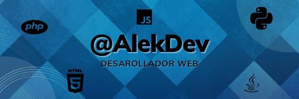

# Hola, soy Alek Caritg 👋  
### Desarrollador Frontend | Apasionado por web y apps móviles

  

---

## 🧑‍💻 Sobre mí

- 🎓 Buscando empresa para prácticas profesionales.  
- 💻 Frontend: HTML · CSS · JavaScript · Angular  
- 🛠️ Backend y bases de datos: conocimientos básicos de PHP, Python, Nodejs MySQL y gestión de datos  
- 🌱 En proceso de aprendizaje y mejora continua.

Durante mi formación en el ciclo de Desarrollo de Aplicaciones Multiplataforma (DAM), he trabajado en proyectos tanto del lado del cliente como del servidor, aprendiendo sobre diseño, lógica de negocio y bases de datos. Mi objetivo es seguir creciendo y aportar valor en proyectos reales.

---

## 🧰 Tecnologías que manejo

  
  

  <!-- Herramientas -->
  
  
  
  

---

## 🚧 Proyectos en desarrollo

> *Actualmente no hay proyectos en desarrollo visibles. ¡Pronto se vienen nuevas ideas!*

---

## ✅ Proyectos terminados

### 💼 Finance App - Gestor de Finanzas

**Descripción:**  
Aplicación web para la gestión personal de finanzas, desarrollada como proyecto final del ciclo DAM.  
Incluye autenticación con JWT, protección de rutas, dashboard dinámico y conexión a base de datos MySQL.

### 🦖 ARK-Survival-Evolved

**Descripción:**  
Mini sitio web hecho solo con **HTML y Bootstrap 5** para practicar maquetación y diseño responsive.  
Contiene un video introductorio de ARK: Survival Evolved, una sección de "Dino-Dossiers" con **cards responsivas** y un formulario de login con diseño moderno.

---

## 🌐 Encuéntrame en

  

---

## ⚙️ Estadísticas de GitHub

